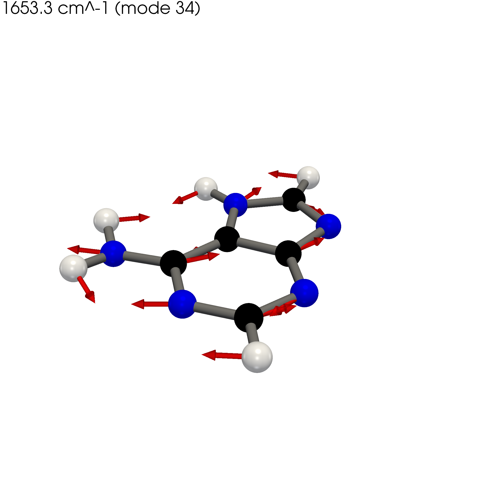
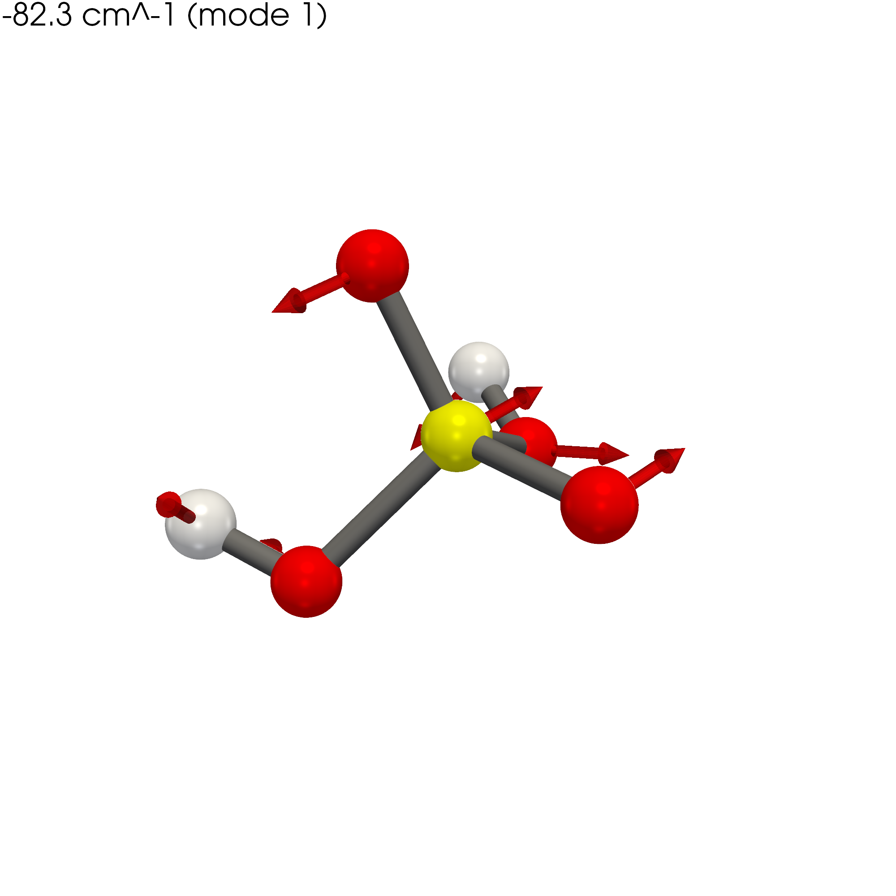

# molvib — Molecular Vibration PNG Generator

Publication-quality 3D renders of molecular vibrational modes, straight from
**Gaussian 16 frequency logs** or **XYZ displacement files**.

`molvib` reads a frequency calculation, picks the modes worth looking at (by IR
intensity, by index, or every imaginary mode), and writes one high-resolution PNG
per mode plus a tidy CSV manifest — from the command line or as an importable
Python API.

<p align="center">
  
  
</p>
<p align="center">
  <em>Left: adenine ring/NH₂ mode at 1653 cm⁻¹ (a minimum). Right: the −82 cm⁻¹
  imaginary mode of an H₂SO₄ transition state — arrows trace the reaction coordinate.</em>
</p>

> Fork of [ashendeema/molecular-vibration-png-generator](https://github.com/ashendeema/molecular-vibration-png-generator).
> The original standalone XYZ script (`xyz_to_png.py`) is preserved unchanged; the
> `molvib` package adds Gaussian-log parsing, mode selection, a manifest, and a CLI.

---

## Why

Gaussian prints normal modes as blocks of displacement vectors buried in a text
log — one mode is not one file, geometry lives in a separate orientation table, and
atoms are identified by atomic number. Visualizing a mode normally means loading the
log into a GUI and screenshotting by hand. `molvib` turns that into a single
reproducible command that a script or a cluster job can call, so a whole directory of
logs becomes a folder of figures and a manifest you can filter.

## Features

- Reads **Gaussian 16** frequency output (`.log` / `.out`) and **XYZ** displacement
  files through one auto-detecting entry point.
- **Standard-orientation frame matching** — geometry and displacements are taken from
  the same reference frame, so arrows always point along the correct bonds.
- Mode selection by **IR intensity**, by **explicit index**, or **all imaginary
  modes** (retained regardless of intensity — the ones that matter for transition-state
  validation).
- Publication-quality PyVista rendering: element-colored atoms, covalent-radius bond
  detection, displacement arrows, per-mode frequency label, transparent or colored
  background, adjustable resolution.
- **Fitted camera** — the full molecule and every arrow stay in frame.
- **CSV manifest** mapping each PNG to its log, mode number, frequency, IR intensity,
  and imaginary flag; invalid logs are routed to a separate bad-logs report instead of
  aborting the run.
- Importable API (`render_file`, `render_directory`, `read_any`, `select_modes`) for
  notebook and pipeline use.
- Full periodic table (H–Og) for colors and Cordero (2008) covalent radii.

---

## Installation

Requires Python 3.9+.

```bash
git clone https://github.com/ishgits/molecular-vibrations.git
cd molecular-vibrations
python -m pip install -e '.[test]'
```

This installs `molvib` and its dependencies (NumPy, pandas, PyVista, VTK) and puts a
`molvib` command on your path. On a headless Linux machine, run the rendering commands
under `xvfb-run` (e.g. `xvfb-run -a molvib --input ...`).

---

## Quick start

```bash
# Render the IR-active modes of a Gaussian log (>= 10 KM/mol by default)
molvib --input examples/logs/adenine_pcm_water.log --outdir figs

# A single mode by index
molvib --input examples/logs/adenine_pcm_water.log --modes 34 --outdir figs

# A transition state — the imaginary mode is always kept
molvib --input examples/logs/neg_test_H2SO4_V_freq.log --outdir figs

# A whole directory at once (globs *.xyz, *.log, *.out)
molvib --input examples/logs/ --ir-threshold 50 --outdir figs
```

`examples/logs/` ships two ready-to-run logs: `adenine_pcm_water.log` (a converged
minimum) and `neg_test_H2SO4_V_freq.log` (a transition state with one imaginary mode).
`end_user_test.ipynb` is a runnable, assertion-checked walkthrough of both.

Output PNGs are named `{logstem}_mode{index:03d}_{freq:.1f}cm.png`; XYZ inputs keep the
original `foo.xyz → foo.png` naming.

---

## Command-line options

| Flag | Meaning |
|---|---|
| `--input` | File or directory. Directories glob `*.xyz`, `*.log`, `*.out`. |
| `--ir-threshold` | IR-intensity cutoff in KM/Mole (default `10.0`). |
| `--include-imaginary` / `--no-include-imaginary` | Keep imaginary modes regardless of intensity (default: keep). |
| `--modes 1,27,39` | Explicit mode indices; overrides the IR filter. |
| `--outdir` | Output directory (default: alongside the input). |
| `--manifest` | Manifest CSV path (default: `outdir/vibration_manifest.csv`). |
| `--resolution 2000x2000` | Output image size. |
| `--background transparent` | `transparent` or a color name/hex. |
| `--zoom 0.9` | Camera zoom; `<1` adds margin so atoms and arrows are never cropped. |
| `--no-arrows` | Hide displacement arrows. |
| `--no-render` | Parse, select, and write the manifest without rendering PNGs (fast dry run). |

---

## Python API

```python
from molvib import read_any, select_modes
from molvib.cli import render_file, render_directory

# Inspect a log without rendering
geometry, modes = read_any("examples/logs/adenine_pcm_water.log")
print(geometry.n_atoms, geometry.source_frame, len(modes))
strong = select_modes(modes, ir_threshold=50.0)

# Render one file -> manifest DataFrame
manifest = render_file("examples/logs/adenine_pcm_water.log", outdir="figs", ir_threshold=50.0)

# Render a directory -> (manifest_df, bad_logs_df); failures don't abort the batch
manifest_df, bad_df = render_directory("examples/logs/", outdir="figs")
```

Rendering parameters are a dataclass:

```python
from molvib.render import RenderSettings
settings = RenderSettings(resolution=(3000, 3000), background="white", camera_zoom=1.0)
render_file("mol.log", settings=settings)
```

### Manifest columns

`source_log`, `png`, `mode_index`, `frequency_cm-1`, `ir_intensity_km/mol`,
`reduced_mass_amu`, `is_imaginary`, `n_atoms`, `geometry_frame`, `rendered`.

---

## How Gaussian logs are parsed

`molvib` supports **standard low-precision Gaussian 16** frequency output. Key
behaviors and limits:

- **Frame matching.** Geometry is read from the *last `Standard orientation` table
  before the frequency section* — the frame in which Gaussian reports the normal
  modes. Displacements and coordinates therefore share a frame, so arrows point
  correctly. If only an `Input orientation` table is present it is used as a fallback
  and recorded in the manifest's `geometry_frame` column.
- **Mode count.** Nonlinear molecules must contain `3N−6` modes; collinear geometries
  are accepted with `3N−5`. A mismatch is rejected.
- **Concatenated / Link1 jobs.** The last complete frequency job is used; an incomplete
  final job falls back to the preceding complete one.
- **Strict validation.** Each block must have an `Atom AN` header and exactly one
  complete displacement row per atom, and the block's atomic numbers must match the
  orientation table. Malformed or truncated blocks are rejected and never rendered.
  Atomic (single-atom) jobs are rejected.
- **Not supported:** HPModes / high-precision coordinate blocks.

### A note on displacement semantics

Gaussian's printed normal coordinates are **normalized Cartesian displacements**, not
mass-weighted eigenvectors and not forces. The renderer scales them to the largest
displacement purely for visualization — **arrow lengths are not physical amplitudes.**
(The original tool's `forces` variable was a misnomer; `molvib` calls these
`displacements`.)

---

## XYZ input

The `molvib` pipeline still accepts XYZ files, one atom per line:

```
Element   X   Y   Z   dx   dy   dz
C   0.000   0.000   0.000   0.12   0.03   0.00
O   1.210   0.000   0.000  -0.10   0.02   0.01
```

where `X Y Z` are coordinates (Å) and `dx dy dz` the displacement vector. The frequency
label is taken from the filename (e.g. `m_165_3150.62.xyz`). The original standalone
script remains available and batch-renders every XYZ in the working directory:

```bash
python xyz_to_png.py
```

---

## Repository structure

```
molecular-vibrations/
│
├── molvib/                     # Gaussian-log + XYZ rendering package
│   ├── readers.py              # read_xyz, read_gaussian_log, read_any
│   ├── select.py               # IR-intensity / imaginary-mode selection
│   ├── render.py               # PyVista rendering + RenderSettings
│   ├── manifest.py             # pandas CSV manifest
│   ├── elements.py             # Z→symbol, colors, covalent radii (H–Og)
│   ├── model.py                # Geometry / Mode / RenderJob dataclasses
│   └── cli.py                  # argparse driver + render_file/render_directory
│
├── xyz_to_png.py               # original standalone XYZ script (unchanged)
├── end_user_test.ipynb         # positive + negative walkthrough / smoke test
│
├── examples/
│   ├── logs/                   # example Gaussian 16 frequency logs
│   └── *.xyz                   # example XYZ displacement files
├── images/                     # showcase + reference renders
├── tests/
│   ├── test_readers.py
│   └── data/                   # parser fixtures
│
├── pyproject.toml
├── requirements.txt
├── LICENSE
└── README.md
```

---

## Testing

```bash
python -m pip install -e '.[test]'
pytest                      # parser + selection unit tests
```

Or open `end_user_test.ipynb` for an end-to-end check: it parses both example logs,
asserts the expected atom/mode counts and the single imaginary mode of the transition
state, renders the selected modes, and verifies the manifest. Every cell is an
assertion, so a clean run validates parsing, frame matching, selection, and rendering
together. On a headless machine, launch Jupyter under `xvfb-run`.

---

## Scientific applications

DFT vibrational analysis, IR/Raman mode visualization, transition-state and
imaginary-frequency diagnosis, teaching materials, and figures for papers and talks.

## Roadmap

- HPModes / high-precision coordinate support
- Additional QM-code parsers (ORCA, VASP)
- Custom camera angles and lighting presets
- Optional legends and per-element labels

---

## License

MIT. See [LICENSE](LICENSE). The original copyright is retained as required.

## Authors

**Original tool** — **Ashen Deemantha Liyanage**, Zayak's Lab, Department of Physics and
Astronomy, Bowling Green State University (BGSU). GitHub:
[@ashendeema](https://github.com/ashendeema)

**`molvib` Gaussian-log extension** — **Ish** ([@ishgits](https://github.com/ishgits)):
Gaussian 16 frequency-log parsing, IR-intensity mode selection, fitted-camera
rendering, CSV manifest, CLI, and test notebook.

If this tool contributes to your research, please cite the repository and the original
author.
