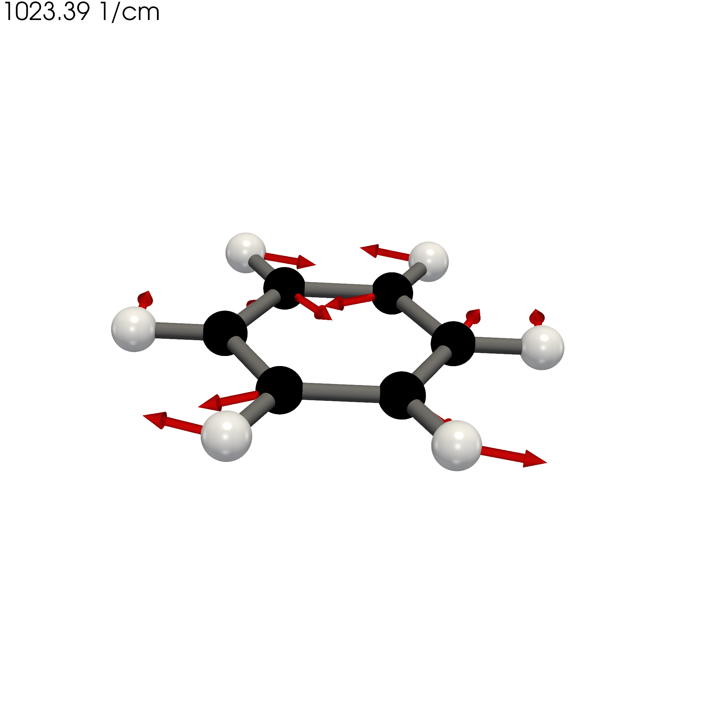

# 3D Molecular Vibration PNG Generator

A Python tool for generating **publication-quality 3D molecular vibration images** from XYZ files containing atomic coordinates and vibrational displacement vectors.

Developed by **Ashen Deemantha Liyanage**  
**Zayak's Lab**  
Department of Physics and Astronomy  
Bowling Green State University (BGSU)

---

## Overview

Visualizing molecular vibrational modes is an essential part of computational chemistry and materials science. This program automatically converts molecular vibration data stored in XYZ files into high-resolution PNG images suitable for:

- Research publications
- Conference presentations
- Teaching materials
- Molecular vibration analysis
- Computational chemistry visualization

The script automatically detects all XYZ files in the working directory, renders the molecular structure in 3D, draws vibrational displacement vectors, and saves a publication-quality PNG image for each molecule.

---

## Features

- Automatically detects all `.xyz` files in the current folder
- Generates high-resolution PNG images
- Publication-quality 3D rendering using PyVista
- Automatic bond detection using covalent radii
- Element-specific atom colors
- Vibrational displacement vectors displayed as red arrows
- Automatic extraction of vibrational frequency from the filename
- Transparent or colored backgrounds
- Adjustable rendering resolution
- Customizable atom, bond, and arrow sizes
- Suitable for DFT vibrational analysis

---

## Example

Input file:

```
m_165_3150.62.xyz
```

Output:

```
m_165_3150.62.png
```

The generated image contains:

- Colored atoms
- Chemical bonds
- Vibrational displacement vectors
- Vibrational frequency label

---

## Input File Format

Each XYZ file should contain one atom per line in the following format:

```
Element   X   Y   Z   Fx   Fy   Fz
```

Example:

```
C   0.000   0.000   0.000   0.12   0.03   0.00
O   1.210   0.000   0.000  -0.10   0.02   0.01
H  -0.620   0.930   0.000   0.03  -0.05   0.00
```

where

- **X Y Z** = Atomic coordinates (Å)
- **Fx Fy Fz** = Vibrational displacement vectors

### Benzene



---

## Installation

### 1. Clone the repository

```bash
git clone https://github.com/ashendeema/molecular-vibration-png-generator.git
``

### 2. Move into the project

```bash
cd molecular-vibration-png-generator
```

### 3. Install the required Python libraries

```bash
pip install -r requirements.txt
```

or install them manually

```bash
pip install numpy pyvista vtk
```

---

## Required Libraries

- Python 3.9 or newer
- NumPy
- PyVista
- VTK

---

## How to Use

Place one or more `.xyz` files in the same directory as the script.

Run

```bash
python xyz_to_png.py
```

The program automatically:

1. Finds all XYZ files
2. Reads atomic coordinates
3. Detects chemical bonds
4. Draws atoms as spheres
5. Draws bonds as cylinders
6. Draws vibrational displacement vectors
7. Extracts vibrational frequency from the filename
8. Saves a PNG image

---

## Adjustable Settings

The following parameters can easily be modified inside the script.

### Rendering

```python
OUTPUT_RESOLUTION = (2000, 2000)
BACKGROUND = "transparent"
```

### Atom Size

```python
ATOM_RADIUS = 0.28
```

### Bond Size

```python
BOND_RADIUS = 0.10
```

### Arrow Size

```python
ARROW_SHAFT_RADIUS = 0.05
ARROW_TIP_RADIUS = 0.10
ARROW_TIP_LENGTH = 0.25
```

### Show or Hide Force Vectors

```python
SHOW_ARROWS = True
```

---

## Scientific Applications

This tool can be used for

- Density Functional Theory (DFT)
- Molecular vibrational analysis
- Raman spectroscopy visualization
- Infrared spectroscopy
- Computational chemistry
- Materials science
- Molecular dynamics visualization

---

## Output

For every input file

```
molecule.xyz
```

the program automatically generates

```
molecule.png
```

at publication quality.

---

## Repository Structure

```
molecular-vibration-png-generator/
│
├── xyz_to_png.py
├── README.md
├── requirements.txt
├── LICENSE
├── .gitignore
│
├── examples/
│   └── example.xyz
│
└── images/
    └── example_output.png
```

---

## Future Improvements

Planned features include

- Multiple lighting models
- Custom camera angles
- Automatic legends
- Batch rendering options
- Surface visualization
- High-resolution publication presets

---

## Citation

If this program contributes to your research, please cite this GitHub repository.

---

## License

This project is distributed under the MIT License.

---

## Author

**Ashen Deemantha Liyanage**

PhD Student  
Department of Physics and Astronomy  
Bowling Green State University (BGSU)

Research Group: **Zayak's Lab**

GitHub:
https://github.com/ashendeema

---

If you find this project useful, consider giving it a ⭐ on GitHub.

# molecular-vibration-png-generator
Python tool for generating publication-quality 3D molecular vibration images from XYZ files using PyVista.
